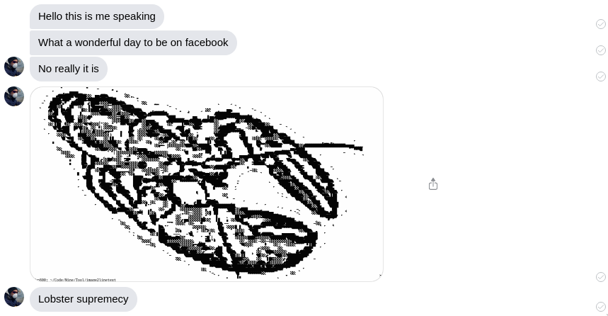

# Facebook Messenger: Normalize

Ever wondered what your messages look like to everyone else? Wonder no more: now
you can!


## Installation

1. Download this project by clicking on `Code` → `Download ZIP`.
2. Unzip the project.
3. In Google Chrome, go to `Settings` → `More tools` → `Extensions` and turn on "Developer mode".
4. Click on `Load extension` and find the project that was extracted.
5. You're done! Go to https://www.messenger.com .


## Preview

Here's an example of what you'll see:




## Why is this not in the Chrome Web Store?

I refuse to pay $5, require a Google account, jump through hoop or two, and
[refuse to accept an agreement which calls this software a product and forces
to me to support it](https://developer.chrome.com/docs/webstore/terms/) (3.5).

Technically I could be violating [Facebook's
Terms](https://www.facebook.com/legal/terms) (3.2.2):

```
You may not upload viruses or malicious code or do anything that could disable,
overburden, or _impair_ the proper working or _appearance of our Products_.
```

...Despite trying to do something good. Because I violate this term, it
subsequently violates Google's Terms (4.4.1):


```
1. knowingly violates a third party's terms of service
```

Wel-come to the f u t u r e
